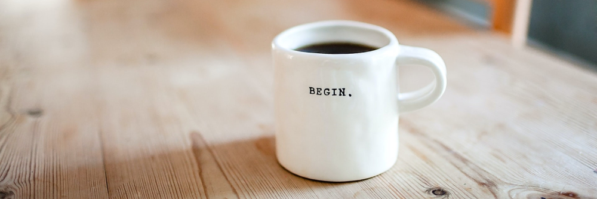
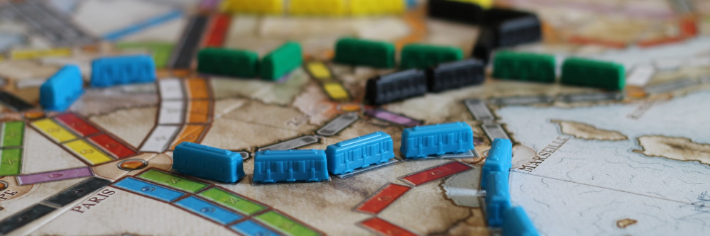

# Currently...

## Practicing

*Photo by [Danielle MacInnes](https://unsplash.com/@dsmacinnes?utm_source=unsplash&utm_medium=referral&utm_content=creditCopyText) on [Unsplash](https://unsplash.com)*
- **[React Native](https://reactnative.dev/)** - see my [KonMari project idea](../projects#ideas-in-progress) to see where I'm heading with this!
- **[Modern Embroidery](https://www.skillshare.com/classes/Painting-with-Thread-Modern-Embroidery-for-Beginners/1597015420/projects)** - this class on Skillshare convinced me to try it!

## Reading

*Photo by [Clay Banks](https://unsplash.com/@claybanks?utm_source=unsplash&utm_medium=referral&utm_content=creditCopyText) on [Unsplash](https://unsplash.com/)*

- **[Range: Why Generalists Triumph in a Specialized World](https://www.goodreads.com/book/show/41795733-range) by David Epstein**
> Plenty of experts argue that anyone who wants to develop a skill, play an instrument, or lead their field should start early, focus intensely, and rack up as many hours of deliberate practice as possible. If you dabble or delay, you'll never catch up to the people who got a head start. But a closer look at research on the world's top performers, from professional athletes to Nobel laureates, shows that early specialization is the exception, not the rule.

## Listening to

*Photo by [Icons8 Team](https://unsplash.com/@icons8?utm_source=unsplash&utm_medium=referral&utm_content=creditCopyText) on [Unsplash](https://unsplash.com/)*

- **[Huberman Lab Podcast](https://www.youtube.com/c/AndrewHubermanLab/about)** - This Podcast makes anyone into brain science excited for Mondays! :)
> The Huberman Lab Podcast is hosted by Dr. Andrew Huberman, a professor of neurobiology and ophthalmology at Stanford School of Medicine. Topics discussed include neuroscience (e.g., brain function, neuroplasticity, neuro-technologies and practical applications of neuroscience)

## Playing

*Photo by [Dave Photoz](https://unsplash.com/@mirapolis?utm_source=unsplash&utm_medium=referral&utm_content=creditCopyText) on [Unsplash](https://unsplash.com)*
- **[Diablo II Resurrected  on PC](https://diablo2.blizzard.com/en-us/)** - A recently released remake of one of my childhood favorites!
